##  .net team came up with  a new architecture wich was .net MVC
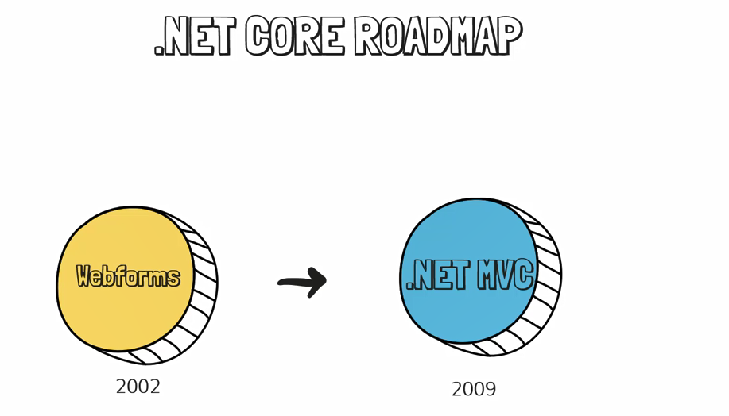 \
it was created on top of the components of web forms becauss of it was tightly tied to IIS and ultimately windows operating system.\
As a result of that In june of 2016 Microsoft released ASP .net core  and it was the first version of .net that was built on top of this new.\
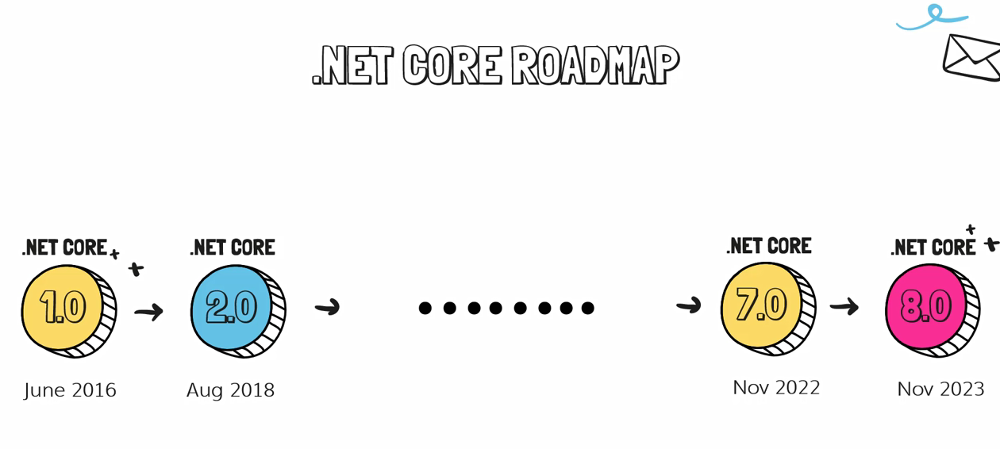
.net core platforn has been completely rewritten and it is a cross platform version. because of that it is not tied to windows os\
it was written with cloud architecture in mind that is exttemly robust\
then in aug 0f 2018 MS released the next version of .net core which is .net core 2.0 

## Is there a reason to use .net core instead of classic .net?
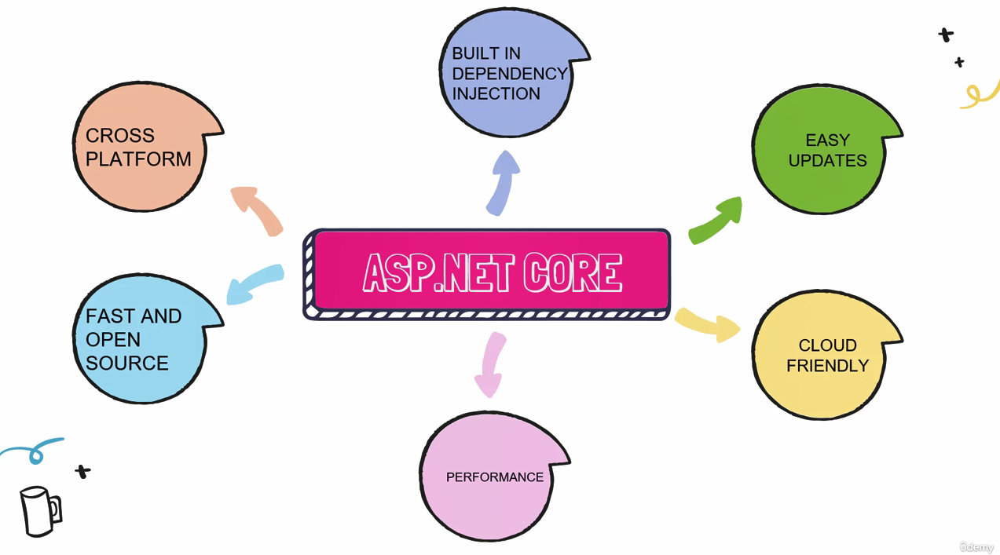\
**Cloud architecture was taken into consideration when writing it**

# At least for this course 
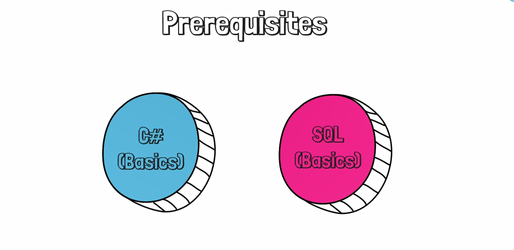

# Tools
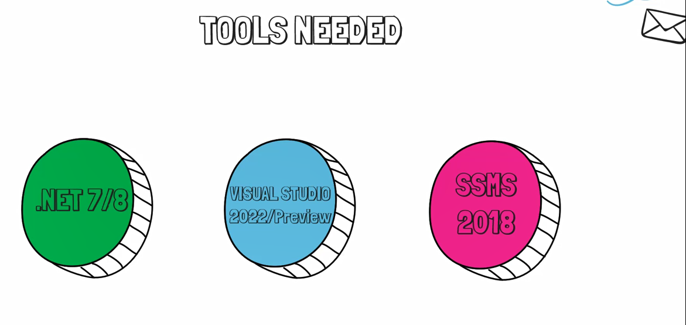
## link
[.net 8.0.1](https://dotnet.microsoft.com/en-us/download/dotnet/8.0)\
[visual studio](https://visualstudio.microsoft.com/downloads/)\
[visual studio miror](https://soft98.ir/263-Visual-Studio.html)\
if you want to upgrade it by new version first make uninstall
 [Visual Studio Uninstaller](https://p30download.ir/fa/entry/70750/visual-studio-uninstaller)
# course overview
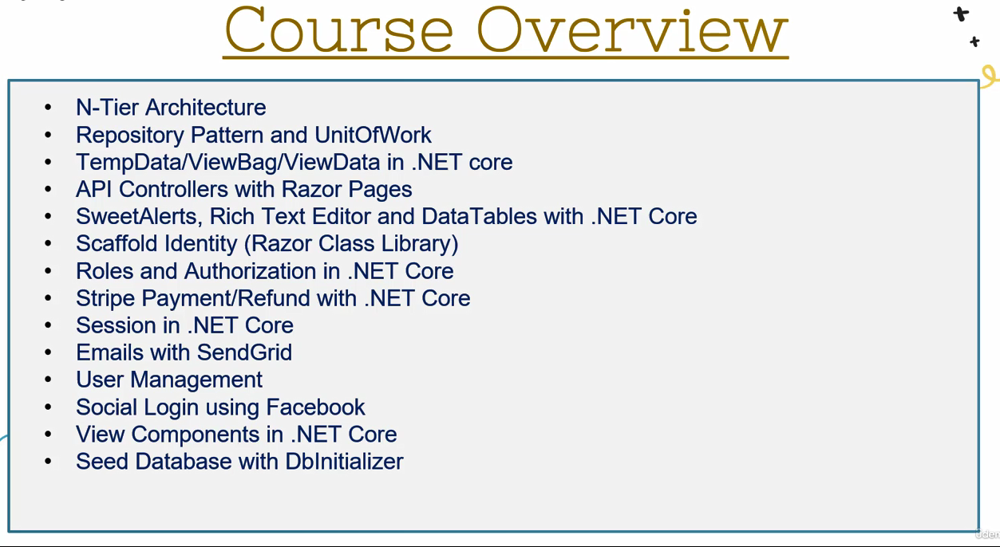
---
# create project and connect repository of github \
 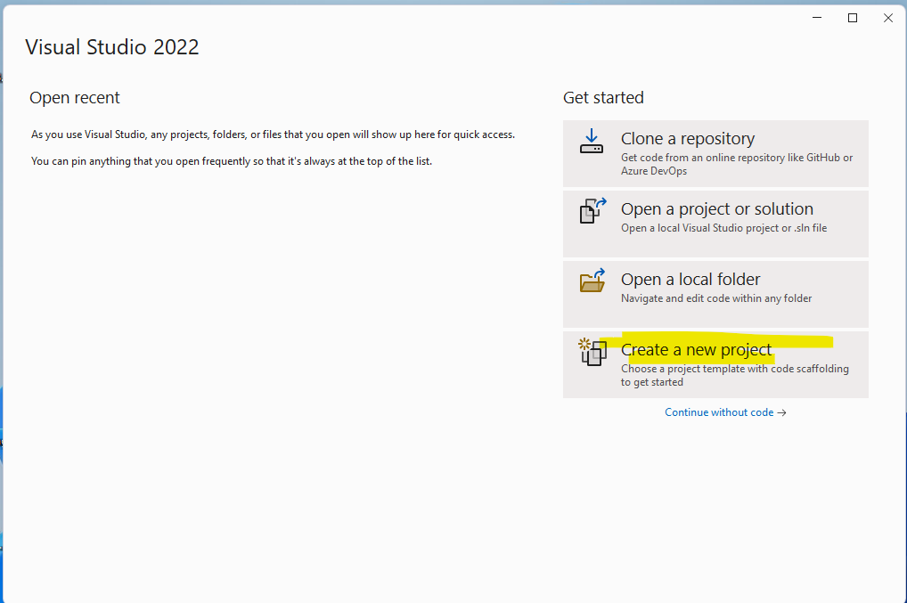
 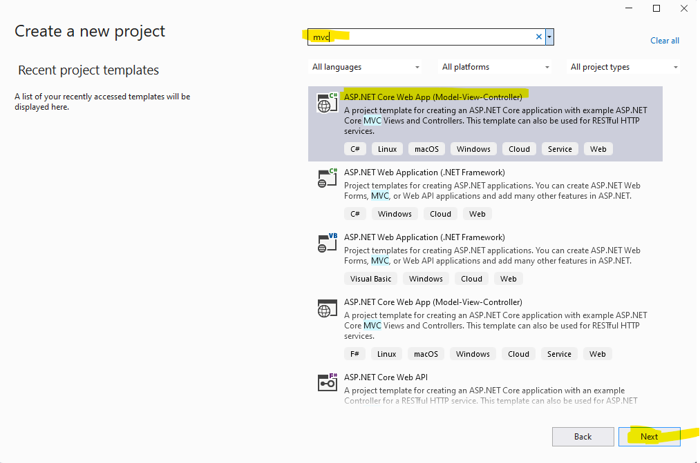
 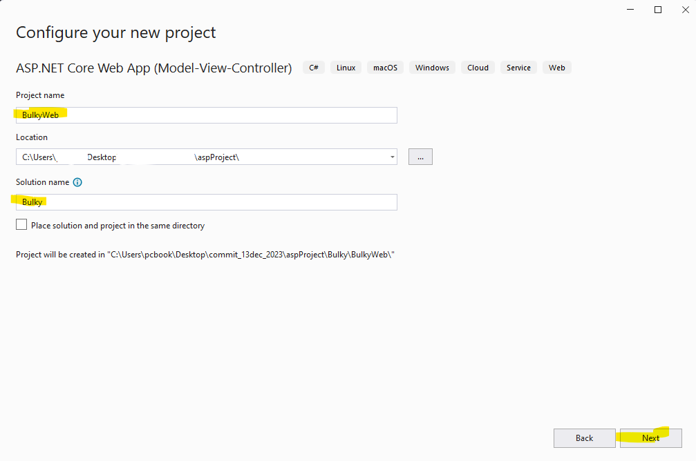
 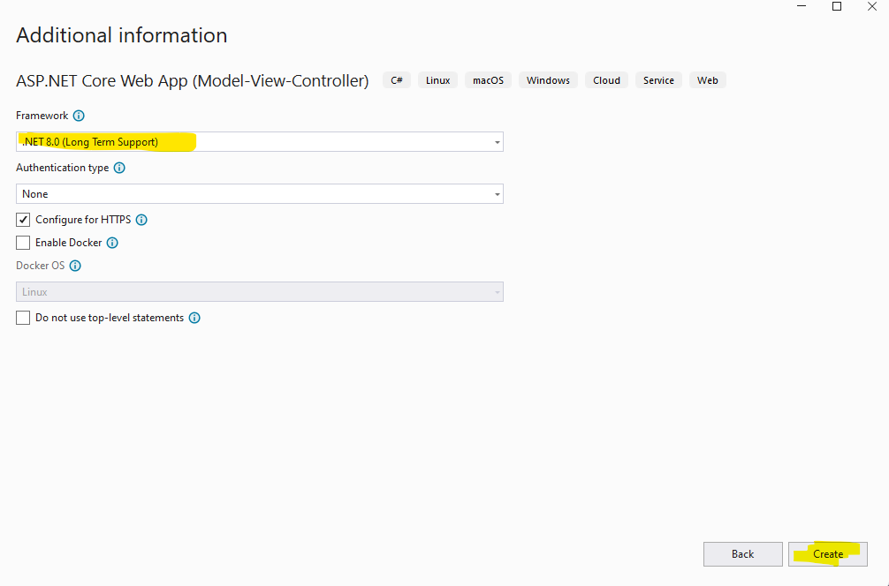
 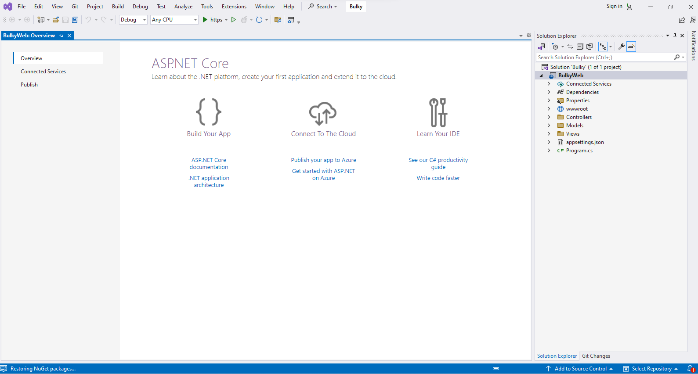
 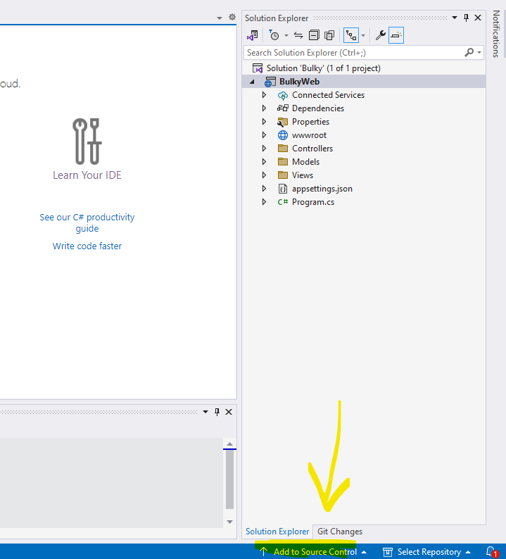
 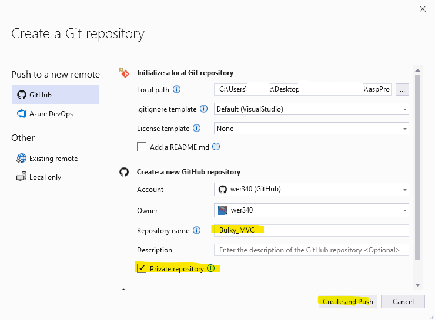\
 ## then open browser \
 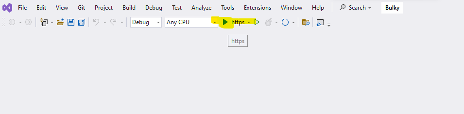 \
 [Patch solution](https/readme.md) if you encounter an issue that is not secure

 
 # open project  click  enter <kbd>↩️</kbd>
 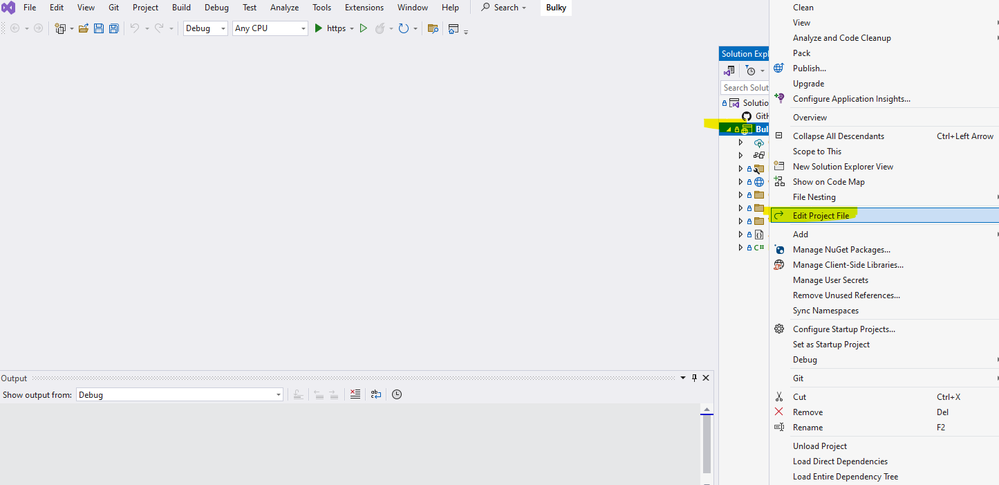

 ## right panel `solution explorer` > propertise > launchSettings.json
 now this file basically defines a file wich will say that when we are runing or debugging\
 ```json
 {
  "$schema": "http://json.schemastore.org/launchsettings.json",
  "iisSettings": {
    "windowsAuthentication": false,
    "anonymousAuthentication": true,
    "iisExpress": {
      "applicationUrl": "http://localhost:3717",
      "sslPort": 44335
    }
  },
  "profiles": {
    "http": {
      "commandName": "Project",
      "dotnetRunMessages": true,
      "launchBrowser": true,
      "applicationUrl": "http://localhost:5100",
      "environmentVariables": {
        "ASPNETCORE_ENVIRONMENT": "Development"
      }
    //and https , IIS
  }
}

 ```
 ## if change and you want to back
 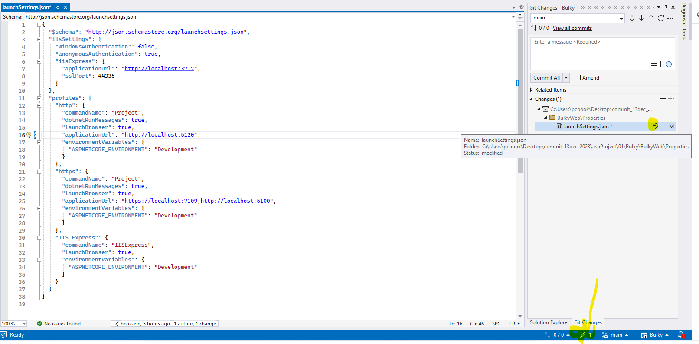\

 ## static site 
 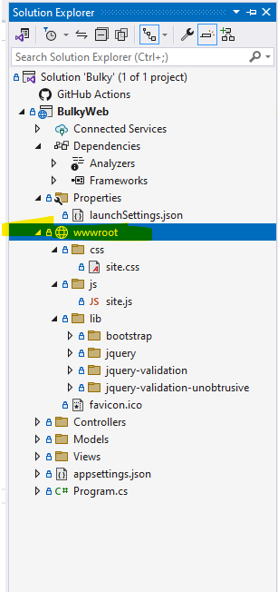\
 ## app setting
 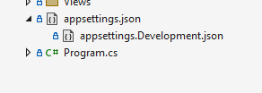\
 app setting will be the place where you will host all of your connection string.\

connection string ,it not just connection string , but basiacally any secret key that you have for your application\
all of those connection in one place that way , you have to change a connection you always know that you have to go to 'appesettings.json' and  not to go through all the code trying to find out where is that connection\

## add appSettingProduction.json
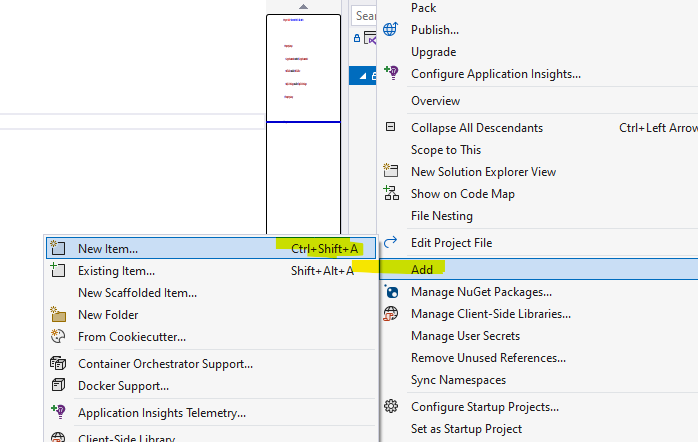
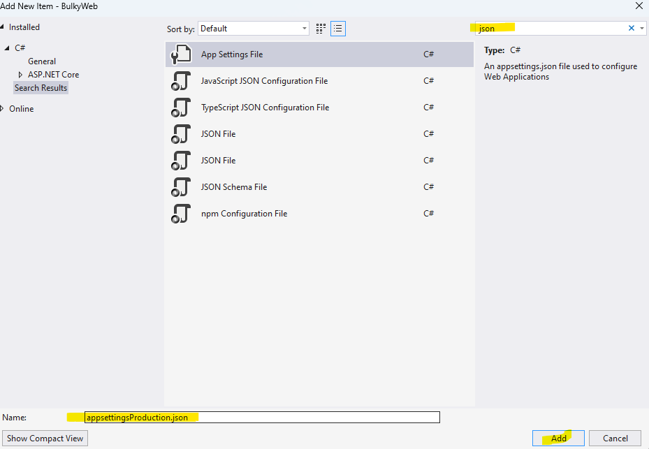
## and change
```json
 {
 .....
  "profiles": {
    "http": {
      "commandName": "Project",
      "dotnetRunMessages": true,
      "launchBrowser": true,
      "applicationUrl": "http://localhost:5100",
      "environmentVariables": {
        "ASPNETCORE_ENVIRONMENT": "Production" //changed
      }
    //and https , IIS
  }
}

 ```
 # Program.cs  amain file
in older .net core we have use two file program.cs and we had Startup.cs\
But the newer version the .net team has combin both files in one file which is the `Program.cs`\
when have to configure a net application there are two things that you should remember \
First we have to add some services to our container and next we have to configure the request pipline \

```cs
//***************1****************
var builder = WebApplication.CreateBuilder(args);

// Add services to the container.
builder.Services.AddControllersWithViews();

var app = builder.Build();
//***************2****************
// Configure the HTTP request pipeline.
if (!app.Environment.IsDevelopment())
{
    app.UseExceptionHandler("/Home/Error");
    // The default HSTS value is 30 days. You may want to change this for production scenarios, see https://aka.ms/aspnetcore-hsts.
    app.UseHsts();
}

app.UseHttpsRedirection();
app.UseStaticFiles();

app.UseRouting();

app.UseAuthorization();

app.MapControllerRoute(
    name: "default",
    pattern: "{controller=Home}/{action=Index}/{id?}");

app.Run();

```
 ## Middleware pipline
in the Program.cs  those are two things that are being handled \
first you can see there is builder dot web application that create a builder  on that builder we are adding some services \
right now we are using MVC for our architecture and that is whay on builder.services it has added something  called as `ADD controllers `with view tha way it knows that okay our application will be using controllers and those are already defined in .net project so i know how to handle that sevices .\
and next thing to configure the request pipeline \
pipline basically means that when a request comes to an application , how do you want to process that?
\
now one thing that you see  in above code   is we have a `app.Environment.IsDevelopment`  this is the same environment variable that we saw in `launchSAetting.json`

# MVC
model view controller\
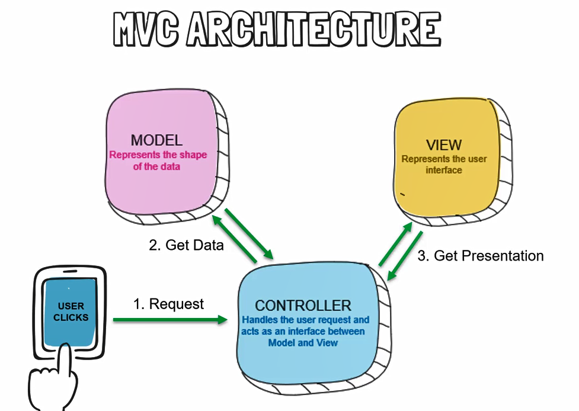

# Route
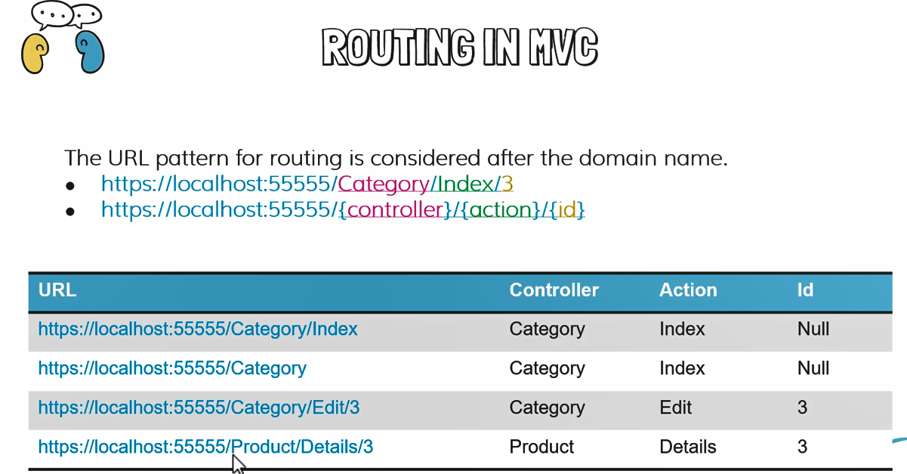\
that model is not always needed\
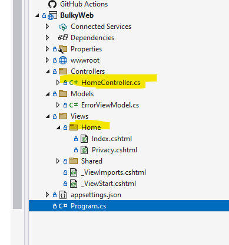  
## controller
```cs
public IActionResult Index() //string Index() , object Index()
{
    return View("privacy"); // index action switch to privacy view
}

```
## why we have a return type of lets say an object or maybe a string or something like a list  or a enumerable .
an action result is one of the custom classes or rather interface that is implemented in the .net framwork and that basically implments all of the possible result type for an action method so even if things are looking like its magic right now it is not 
## master page and child page 
`_layout` is the master page of your complete application 
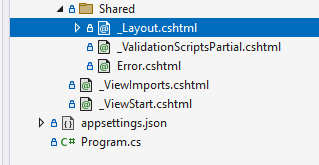\

`@RenderBody` is a built in helper in the MVC and that will display anything that we want in the body\

### But typically if that ia a page or component that is used throught the application then w etypically like to add an underscore `_`  that way , when we look at the name , we acan know that , okay , this view will be used throughout the application  \

 we define that inside the file wich is `_ViewStart.cshtml` there we are telling that the layout of the application is `_Layout`