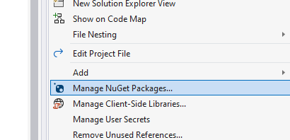
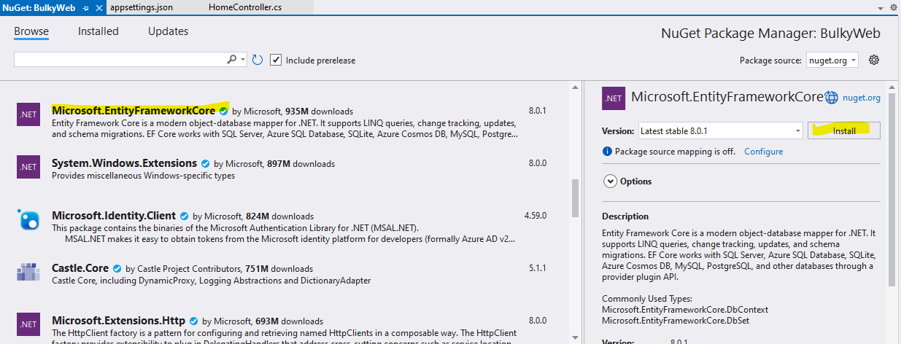
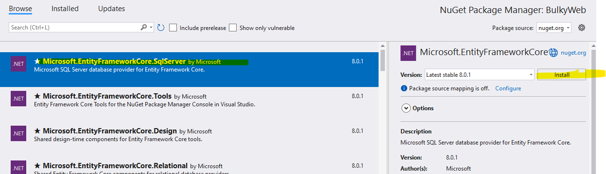
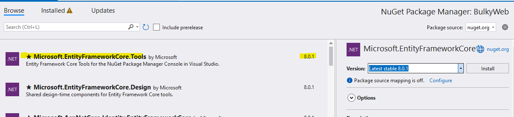
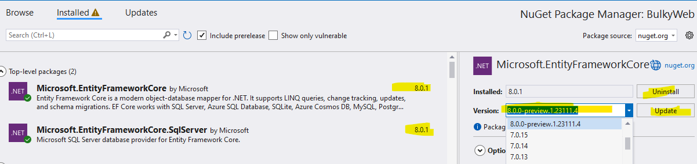

Rather we create a model in our project and we tell entity framework that hey based on the model that i have created here i want you to figure out and create table inside db and do that automatically .\
## model 📁 > right click >Add >class 
now it does not have to be inside the model folder  there are no rules about that it is one of theose things that models we typically add them in the models folder you can rename that folder if you want but i wanted to point out that model is not something that is required \

## code snippet  
```cs
public int MyProperty { get; set; }
```
 ## type `prop` and click <kbd>Tab</kbd>
```cs
 public int Id { get; set; }
 public String Name { get; set; }
 public int DisplayOrder { get; set; }
```
if we have multiple categories which category should be displayed first on the page that will define the display order\
## How do we define or rather say that this Id must be the primery key?
let say if the naame is category `___` `3`underscore and then we have the Id  then  how can figure out  entity farmwork know this primary key ? so here in square bracket , if write key you can see it is system dot component model that data annotation \
```cs
 [Key]
 public int Id { get; set; }
 [Required]
 public String Name { get; set; }
 public int DisplayOrder { get; set; }
```
## nuget package
entity framwork core is the fw that will let us do all the things related to db  directly from the code here . the old days entity fw is included the main .net application   

## Microsoft.EntityFrameworkCore

## Microsoft.EntityFrameworkCore.SqlServer
 
## Microsoft.EntityFrameworkCore.Tools 
 

### a one thing that i will always remind you is if you installed one preview version or even any .net version💎 **make sure all the Microsoft package are of the same version**.
 \

## check
BulkyWeb right click > edit project or enter↩️   \
see all package \
```cs
 <ItemGroup>
   <PackageReference Include="Microsoft.EntityFrameworkCore" Version="8.0.1" />
   <PackageReference Include="Microsoft.EntityFrameworkCore.SqlServer" Version="8.0.1" />
   <PackageReference Include="Microsoft.EntityFrameworkCore.Tools" Version="8.0.1">
     <PrivateAssets>all</PrivateAssets>
     <IncludeAssets>runtime; build; native; contentfiles; analyzers; buildtransitive</IncludeAssets>
   </PackageReference>
 </ItemGroup>
```
this is the actual location that is very important .\
that way project knows a which project are all the packages that are being used and it will load all of them


