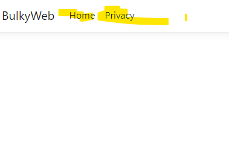

Rather we create a model in our project and we tell entity framework that hey based on the model that i have created here i want you to figure out and create table inside db and do that automatically .\
## model 📁 > right click >Add >class 
now it does not have to be inside the model folder  there are no rules about that it is one of theose things that models we typically add them in the models folder you can rename that folder if you want but i wanted to point out that model is not something that is required \

## code snippet  
```cs
public int MyProperty { get; set; }
```
 ## type `prop` and click <kbd>Tab</kbd>
```cs
 public int Id { get; set; }
 public String Name { get; set; }
 public int DisplayOrder { get; set; }
```
if we have multiple categories which category should be displayed first on the page that will define the display order\
## How do we define or rather say that this Id must be the primery key?
let say if the naame is category `___` `3`underscore and then we have the Id  then  how can figure out  entity farmwork know this primary key ? so here in square bracket , if write key you can see it is system dot component model that data annotation \
```cs
 [Key]
 public int Id { get; set; }
 [Required]
 public String Name { get; set; }
 public int DisplayOrder { get; set; }
```
## nuget package
entity framwork core is the fw that will let us do all the things related to db  directly from the code here . the old days entity fw is included the main .net application   

## Microsoft.EntityFrameworkCore

## Microsoft.EntityFrameworkCore.SqlServer
 
## Microsoft.EntityFrameworkCore.Tools 
 

### a one thing that i will always remind you is if you installed one preview version or even any .net version💎 **make sure all the Microsoft package are of the same version**.
 \

## check
BulkyWeb right click > edit project or enter↩️   \
see all package \
```cs
 <ItemGroup>
   <PackageReference Include="Microsoft.EntityFrameworkCore" Version="8.0.1" />
   <PackageReference Include="Microsoft.EntityFrameworkCore.SqlServer" Version="8.0.1" />
   <PackageReference Include="Microsoft.EntityFrameworkCore.Tools" Version="8.0.1">
     <PrivateAssets>all</PrivateAssets>
     <IncludeAssets>runtime; build; native; contentfiles; analyzers; buildtransitive</IncludeAssets>
   </PackageReference>
 </ItemGroup>
```
this is the actual location that is very important .\
that way project knows a which project are all the packages that are being used and it will load all of them

# sql server connect to project
we need to define connection string inside our project  but for taht we need to define connection string our project \
### where we define that?
you can alaways hardcode that in  `program.cs` where we will be setting up the entity framework but all the connection and secrets will always go inside `appsettings.json` \
it is a basic json file where we have a key and we have value  so if you have to define something with connection string you can say connection here \
connectionStrings that is one of the helper methods that have been provided with the app settings. \
server = adress  , Database=name ,   
Trusted_Connection=True , TrustServerCertificate=True  if you do not define sometime when you have installed the sql it require a trust certificate.

## ApplictionDbContext
we will adding something to establish the connection between our **database** and **entity framework** \
we will create new file but in the main project we will right click add a new folder with name \


## note for remember
whatever we will do next is basic  configuration that is needed for entity framework \
if you  have to set up some other package in an application , in any programming language there are **some things that you have to do**   \
it is the basic syntax or basic classes that has to be configured in this way.in order to use entity framework core \
### implement Dbcontext class
 Dbcontext class is basically the root class of entity framework core using wich will be accessing  entity framework \
 `using Microsoft.EntityFrameworkCore;`  \
 ```
 using BulkyWeb.Models;
using Microsoft.EntityFrameworkCore;
namespace BulkyWeb.Data
{
    public class ApplicationDbContext: DbContext
    {
        public ApplicationDbContext(DbContextOptions<ApplicationDbContext> options) : base(options)
        {    
        }
        public DbSet <Category> Categories { get; set; }
    }
 ```
so our aplicationDbContext class now implements or inherits the Sbcontext class which is a built in calss inside the entity framework core NuGet package\
## how we will pass the connetion string that we have inside Appseting.json to our dbcontext?
when we will inject this applicationDbContext or rather configure the applicationDbcContext \
we will get that connection string as a parameter in the constructor as context option and that w ewill be passing on the base class\
snippet code  `ctor` that make constructor \
we will be configuring something called as DbContextoptions and that will be on the class which is applicationDbcontext\
i will call that as options
```
using BulkyWeb.Models;
using Microsoft.EntityFrameworkCore;

namespace BulkyWeb.Data
{
    public class ApplicationDbContext: DbContext
    {
        
        public ApplicationDbContext(DbContextOptions<ApplicationDbContext> options) : base(options)
        {
            
        }
        public DbSet <Category> Categories { get; set; }
    }
}
```
we register application Dbcontext  we will adding some configuartion \
whatever configuartion that we add here we want to pass that to DBcontext class \
`:base (options)`  if we have to pass that in c# we will write base here and we will pass the options like that\
in `program.cs`\
when ever we have to register something we will do that in `program.cs`  \
we are adding  services to container \
``` c#
using BulkyWeb.Data;
using Microsoft.EntityFrameworkCore;
// Add services to the container.
builder.Services.AddControllersWithViews();
builder.Services.AddDbContext<ApplicationDbContext>(options => 
options.UseSqlServer( builder.Configuration.GetConnectionString("DefaultConnection")));
var app = builder.Build();
```
we want to tell applicaion hey we want to use entity framwork
# test connection to microsoft sql server
## first thing we need to launch sql server and connect
 
 ## dash case for writing commands
 write command  `update-database`   database is created\
 if encountered with error checking the `program.cs` and `appsetting.json` take look `DefaultConnection` proprty  and see  value `server=.`\


#  create table
### for creating table to the  database in sql server  write command in 📁data  ➡️ `ApllicationDbContext` \ 
`public DbSet <Category> Categories { get; set; }`
this simple one line will automatically create the table that is the power of the entityFramework core \
in order to create table we have to do something called as a `migration` \
go to terminal ➡️ `add-migration AddCategoryTableToDb` then with  `update-database` apply to database \
note every table  want to created  needed to primery key  🔥data anotation 📁model name  check [key] \


### crud in category controller 
📁Controllers > `CategoryController.cs`\
```c#
using Microsoft.AspNetCore.Mvc;

namespace BulkyWeb.Controllers
{
    public class CategoryController : Controller
    {
        public IActionResult Index()
        {
            return View();
        }
    }
}

```
### example.com/controller/action
 create razor view for new controler \
 📁views > new folder   📁Category  > inside there   add > view.. > Razor View -Empty > write name `index.cs`\
 add html tag ..   \
 and go  localhost/category/index   see first controler  \
  
## category link to header page 
 \
go to 📁views  📁shared  > _Layout.cshtml  \
```html
<a class="nav-link text-dark" asp-area="" asp-controller="Category" asp-action="Index">Category</a>
``` 
you acan think of them as helper function or helper entity 

## seed category
\

now if you want you can do edit top 200 and basically add some category right here\
but rather than that entity frameworkcore provides you with some helper functions (OnModelCreating) on if you have to seed some entites in your database \
📁Date  >`ApplicationDbContext` >   \
```c#
 protected override void OnModelCreating(ModelBuilder modelBuilder)
 {
     modelBuilder.Entity<Category>().HasData(

         new Category { Id=1,Name="Action",DisplayOrder=1},
         new Category { Id=2,Name="SciFi",DisplayOrder=2},
         new Category { Id=3,Name="History",DisplayOrder=3}
         
         );
 }
```
# whenever anything  has to  be updated with database , we have to add a migration

Run command in terminal `add-migration SeedCategoryTable`  and then `update-database` \

## retrive them from category table  in view 


